<div align="center">

# 📊 Sistema de Integração e Processamento de Dados da ANS

### Pipeline Automatizado de Análise de Dados de Saúde Suplementar

[](https://www.python.org/downloads/)
[](LICENSE)
[]()
[](https://github.com/psf/black)

</div>

---

## 📑 Índice

- [Visão Geral](#-visão-geral)
- [Funcionalidades](#-funcionalidades)
- [Arquitetura do Projeto](#-arquitetura-do-projeto)
- [Decisões Técnicas](#-decisões-técnicas)
- [Tecnologias Utilizadas](#-tecnologias-utilizadas)
- [Estrutura do Projeto](#-estrutura-do-projeto)
- [Como Executar](#-como-executar)
- [Observações](#-observações)
- [Contribuindo](#-contribuindo)
- [Licença](#-licença)
- [Contato](#-contato)

---

## 🎯 Visão Geral

Este projeto implementa um **pipeline automatizado em Python** para coleta, consolidação, validação e agregação de dados públicos disponibilizados pela **Agência Nacional de Saúde Suplementar (ANS)**.

O objetivo foi desenvolver uma solução estruturada para automação de coleta e tratamento de dados públicos, aplicando conceitos de integração HTTP, manipulação de arquivos, validação de dados e análise estatística básica.

---

## ✨ Funcionalidades

| Funcionalidade | Descrição |
|----------------|-----------|
| 🔄 **Download Automatizado** | Coleta automática dos demonstrativos contábeis mais recentes |
| 📅 **Identificação de Trimestres** | Detecta e processa os 3 trimestres mais recentes disponíveis |
| 💰 **Consolidação de Despesas** | Extração e consolidação de despesas por operadora |
| ✅ **Validação de CNPJ** | Validação com cálculo oficial de dígito verificador |
| 🔍 **Enriquecimento de Dados** | Cruzamento com base cadastral (CADOP) |
| 📊 **Análise Estatística** | Agregação com total, média trimestral e desvio padrão |

---

## 🏗 Arquitetura do Projeto

O pipeline foi dividido em **duas etapas principais**:

```mermaid
graph LR
    A[🌐 Portal ANS] -->|HTTP Request| B[📥 Etapa 1: Integração]
    B -->|Download & Extract| C[💾 Dados Brutos]
    C -->|Processamento| D[📋 Consolidado CSV]
    D -->|Validação| E[✅ Etapa 2: Validação]
    E -->|Enriquecimento| F[📊 Dados Agregados]
    
    style A fill:#e1f5ff
    style B fill:#b3e5fc
    style C fill:#81d4fa
    style D fill:#4fc3f7
    style E fill:#29b6f6
    style F fill:#0288d1
```

<div align="center">



</div>

### 🔹 Etapa 1 — Integração e Consolidação

**Responsável por:**
- ✓ Acessar repositório público da ANS via HTTP
- ✓ Identificar automaticamente os trimestres disponíveis
- ✓ Implementar mecanismo de retry para requisições
- ✓ Baixar e extrair arquivos ZIP
- ✓ Processar múltiplos CSVs
- ✓ Filtrar registros relevantes (despesas, sinistros, eventos)
- ✓ Consolidar valores por operadora (REG_ANS)

**Saída gerada:**

```
data/processed/consolidado_despesas.csv
```

### 🔹 Etapa 2 — Validação e Enriquecimento

**Responsável por:**
- ✓ Normalização e validação de CNPJ com cálculo oficial de dígitos verificadores
- ✓ Cruzamento com base cadastral CADOP
- ✓ Classificação de registros inconsistentes
- ✓ Enriquecimento com:
  - CNPJ
  - Razão Social
  - UF
  - Modalidade
- ✓ Agregação por operadora e estado

**Cálculos realizados:**
- 📈 Total de despesas
- 📊 Média trimestral
- 📉 Variância
- 📐 Desvio padrão

**Saída gerada:**

```
data/processed/despesas_agregadas.csv
```

---

## 🧠 Decisões Técnicas

<details>
<summary>🔍 Clique para expandir</summary>

- 🔄 **Requests com controle de falha**: Implementação de retry para maior resiliência
- 🌐 **Parsing HTML**: Utilização de BeautifulSoup para extração de dados
- 🔎 **Regex**: Extração de padrões de nome via expressões regulares
- 📄 **Processamento de CSV**: Tratamento de encoding (latin-1)
- 📊 **Agregações**: Uso de defaultdict para agregações eficientes
- ✅ **Validação de CNPJ**: Implementação manual do algoritmo oficial
- 🏗️ **Estrutura modular**: Separação clara entre integração e processamento

</details>

---

## 🛠 Tecnologias Utilizadas

<div align="center">

| Tecnologia | Versão | Uso |
|------------|--------|-----|
|  | 3.10+ | Linguagem principal |
|  | latest | Cliente HTTP |
|  | latest | Parsing HTML |
|  | builtin | Processamento de dados |
|  | builtin | Padrões de texto |

</div>

---

## 📁 Estrutura do Projeto

```
📦 ans-data-pipeline
┣ 📂 script_python
┃ ┣ 📜 part_1_integracao.py      # Etapa 1: Download e consolidação
┃ ┗ 📜 part_2_validacao.py       # Etapa 2: Validação e enriquecimento
┣ 📂 data
┃ ┣ 📂 raw                        # Dados brutos baixados
┃ ┣ 📂 extracted                  # Arquivos extraídos
┃ ┗ 📂 processed                  # Dados processados (output final)
┣ 📜 requirements.txt             # Dependências do projeto
┣ 📜 run_pipeline.py              # Script principal de execução
┗ 📜 README.md                    # Este arquivo
```

---

## ▶️ Como Executar

### 📋 Pré-requisitos

- Python 3.10 ou superior
- pip (gerenciador de pacotes Python)

### 🚀 Instalação e Execução

1️⃣ **Clone o repositório:**

```bash
git clone https://github.com/lenvy001/ans-data-pipeline.git
cd ans-data-pipeline
```

2️⃣ **Instale as dependências:**

```bash
pip install -r requirements.txt
```

3️⃣ **Execute o pipeline completo:**

```bash
python run_pipeline.py
```

4️⃣ **Ou execute cada etapa separadamente:**

```bash
# Etapa 1: Integração e consolidação
python script_python/part_1_integracao.py

# Etapa 2: Validação e enriquecimento
python script_python/part_2_validacao.py
```

5️⃣ **Verifique os resultados:**

Os arquivos finais serão gerados na pasta:

```
📂 data/processed/
  ┣ 📊 consolidado_despesas.csv    # Dados consolidados
  ┗ 📊 despesas_agregadas.csv      # Dados agregados e enriquecidos
```

---

## 📌 Observações

> ⚠️ **Importante**: Os dados utilizados são públicos e obtidos diretamente do portal oficial da ANS.

💡 **Possíveis Extensões:**
- 🗄️ Persistência em banco de dados (PostgreSQL, MongoDB)
- 🌐 Exposição via API REST (FastAPI, Flask)
- 📊 Dashboard de visualização (Streamlit, Plotly Dash)
- ⚡ Processamento paralelo para maior performance
- 🔔 Sistema de notificações e alertas
- 📅 Agendamento automático (cron, Apache Airflow)

---

## 🤝 Contribuindo

Contribuições são bem-vindas! Sinta-se à vontade para:

1. 🍴 Fazer um fork do projeto
2. 🌿 Criar uma branch para sua feature (`git checkout -b feature/AmazingFeature`)
3. 💾 Commit suas mudanças (`git commit -m 'Add some AmazingFeature'`)
4. 📤 Push para a branch (`git push origin feature/AmazingFeature`)
5. 🎉 Abrir um Pull Request

---

## 📄 Licença

Este projeto está sob a licença MIT. Veja o arquivo `LICENSE` para mais detalhes.

---

## 📧 Contato

**Autor:** lenvy001

- 💼 GitHub: [@lenvy001](https://github.com/lenvy001)
- 📂 Projeto: [ans-data-pipeline](https://github.com/lenvy001/ans-data-pipeline)

---

<div align="center">

**⭐ Se este projeto foi útil para você, considere dar uma estrela!**

[](https://github.com/lenvy001/ans-data-pipeline/stargazers)
[](https://github.com/lenvy001/ans-data-pipeline/network/members)

Feito com ❤️ e Python 🐍

</div>
